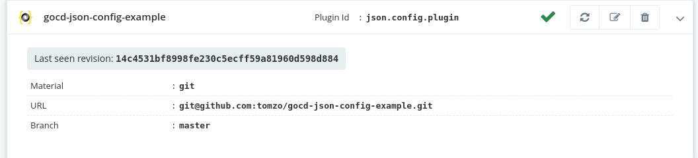

[](https://gitter.im/gocd/configrepo-plugins?utm_source=badge&utm_medium=badge&utm_campaign=pr-badge&utm_content=badge)

# GoCD JSON configuration plugin

[](https://travis-ci.com/tomzo/gocd-json-config-plugin)

**GoCD pipeline configuration as code**

This is a [GoCD](https://www.gocd.org) server plugin which allows to keep **pipelines** and **environments** configuration
in version control systems supported by GoCD (git, svn, mercurial, etc.).
See [this document](https://docs.gocd.org/current/advanced_usage/pipelines_as_code.html)
to find out what GoCD's configuration repositories are.

# Table of contents

1. [Setup](#setup)
1. [File pattern](#file-pattern)
1. [Validation](#Validation)
1. **[Format reference](#JSON-Configuration-reference)**
1. [Format version](#Format-version)
1. [Issues and questions](#Issues-and-questions)
1. [Development](#Development)
1. [License](#License)

# Setup

**Step 1**: GoCD versions newer than `17.8.0` already have the plugin bundled. You don't need to install anything.

If you're using GoCD version *older than 17.8.0*, you need to install the plugin in the GoCD server. Download it from
[the releases page](https://github.com/tomzo/gocd-json-config-plugin/releases) and place it on the GoCD server in
`plugins/external` [directory](https://docs.gocd.org/current/extension_points/plugin_user_guide.html).


**Step 2**: Follow [the GoCD documentation](https://docs.gocd.org/current/advanced_usage/pipelines_as_code.html#storing-pipeline-configuration-in-json) to add a new configuration repository.

You can use the example repository at: `https://github.com/tomzo/gocd-json-config-example.git` as a reference.

In your config repo (`tomzo/gocd-json-config-example.git` in this case), ensure that your GoCD json config is suffixed with `.gopipeline.json` for pipelines and `.goenvironment.json` for environments. Give it a minute or so for the polling to happen. Once that happens, you should see your pipeline(s) on your dashboard.

## File pattern

Using this plugin you can store any number of pipeline or environment
configurations in a versioned repository like git.

By default **pipelines** should be stored in `*.gopipeline.json` files
and **environments** should be stored in `*.goenvironment.json` files.

The file name pattern can be changed on plugin configuration page.

# Validation

There is an ongoing effort to allow in-depth validation of configuration **before pushing configuration to the source control**. This is provided by [GoCD's preflight API](https://api.gocd.org/current/#preflight-check-of-config-repo-configurations) and [gocd-cli](https://github.com/gocd-contrib/gocd-cli).

You have several options to configure validation tools on your workstation:
 * If you have a local docker daemon, use the [gocd-cli-dojo](https://github.com/gocd-contrib/docker-gocd-cli-dojo) image. Follow the [setup instructions](https://github.com/gocd-contrib/docker-gocd-cli-dojo#setup) in the image readme.
 * If you don't want to use docker, you'll need to [setup `gocd-cli` on your host](https://github.com/gocd-contrib/gocd-cli).

Either way you'll have `gocd` binary in your `PATH` or inside the docker container.

## Syntax validation

This will check general validity of the yaml file, without talking to the GoCD server:
```bash
gocd configrepo --json syntax ci.gopipeline.json
```

## Preflight validation

This command will parse and submit your json file to the configured GoCD server.
```
gocd configrepo preflight --json -r gocd-json-config-example *.gopipeline.json
```
Where `-r` is the configuration repository id, which you have earlier configured on GoCD server. You can check it on config repos page of your GoCD server, at `/go/admin/config_repos`. It is in the upper left corner of each config repo.


# JSON Configuration reference

The **pipeline configuration** files should be stored in format *similar* to
one exposed by [GoCD API](https://api.gocd.org/current#get-pipeline-config).

The format of **environment configuration** files is much simpler,
you can find examples of correct environments [below](#environment).

1. [Format version](#format-version)
1. [Environment](#environment)
1. [Environment variables](#environment-variables)
1. [Pipeline](#pipeline)
    * [Locking](#pipeline-locking)
    * [Controlling the display order](#display-order-of-pipelines)
    * [Timer](#timer)
    * [Tracking tool](#tracking-tool)
    * [Mingle](#mingle)
1. [Stage](#stage)
    * [Approval](#approval)
1. [Job](#job)
    * [Property](#property)
    * [Tab](#tab)
    * [Many instances](#run-many-instances)
1. [Tasks](#tasks)
    * [rake](#rake)
    * [ant](#ant)
    * [nant](#nant)
    * [exec](#exec)
    * [fetch](#fetch)
    * [pluggabletask](#plugin)
1. [Materials](#materials)
    * [dependency](#dependency)
    * [package](#package)
    * [git](#git)
    * [svn](#svn)
    * [perforce](#perforce)
    * [tfs](#tfs)
    * [hg](#hg)
    * [pluggable scm](#pluggable-scm)
    * [configrepo](#configrepo)


### Format version

Please note that it is now recommended to declare the _same_ `format_version` in each `*.gopipeline.json` or `*.goenvironment.json` file.

#### GoCD server version from 19.3.0 and beyond

Supports `format_version` value of `4`. In this version, support has been added to control the [display order of pipelines](#display-order-of-pipelines).

This server version also supports `format_version` of `3` and `2`. Using a newer `format_version` includes all the behavior of the previous versions too.

#### GoCD server version from 18.7.0 to 19.2.0

Supports `format_version` value of `3`. In this version [fetch artifact](#fetch) format was changed to include `artifact_origin`.

This server version also supports `format_version` of `2`. Using a newer `format_version` includes all the behavior of the previous versions too.

#### GoCD server version up to 18.6.0

Supports `format_version` value of `2`. In this version [pipeline locking](#pipeline-locking) behavior was changed.


# Environment

Configures a [GoCD environment](https://docs.gocd.org/current/configuration/managing_environments.html)

```json
{
  "name": "dev",
  "environment_variables": [
    {
      "name": "key1",
      "value": "value1"
    }
  ],
  "agents": [
    "123"
  ],
  "pipelines": [
    "mypipeline1"
  ]
}
```

# Environment variables

Environment variables is a JSON array that can be declared in Environments, Pipelines, Stages and Jobs.

Any variable must contain `name` and `value` or `encrypted_value`.

```json
{
  "environment_variables": [
    {
      "name": "key1",
      "value": "value1"
    },
    {
      "name": "keyd",
      "encrypted_value": "v12@SDfwez"
    }
  ]
}
```

# Pipeline

```json
{
  "format_version" : 1,
  "group": "group1",
  "name": "pipe2",
  "label_template": "foo-1.0-${COUNT}",
  "enable_pipeline_locking" : false,
  "parameters": [
    {
      "name": "param",
      "value": "parameter"
    }
  ],
  "mingle": {
    "base_url": "http://mingle.example.com",
    "project_identifier": "my_project"
  },
  "tracking_tool": null,
  "timer": {
    "spec": "0 15 10 * * ? *"
  },
  "environment_variables": [],
  "materials": [
    ...
  ],
  "stages": [
    ...
  ]
}
```

#### Referencing an existing template in a config repo:

```json
{
  "format_version" : 1,
  "group": "group1",
  "name": "pipe-with-template",
  "label_template": "foo-1.0-${COUNT}",
  "enable_pipeline_locking" : false,
  "template": "template1",
  "parameters": [
    {
      "name": "param",
      "value": "parameter"
    }
  ],
  "materials": [
    ...
  ]
}
```

Please note:

 * Pipeline declares a group to which it belongs

### Pipeline locking

Expected since GoCD v17.12, you need to use `lock_behavior` rather than `enable_pipeline_locking`.
```
"lock_behavior" : "none"
```

`lock_behavior` can be one of:
 * `lockOnFailure` - same as `enable_pipeline_locking: true`
 * `unlockWhenFinished` -
 * `none` - same `enable_pipeline_locking: false`

<a name="display-order-of-pipelines"/>

### Controlling the display order

When `format_version` is `4` (see [above](#format-version)), the order of display of pipelines on the GoCD dashboard can be influenced by setting the `display_order_weight` property.

- This is an integer property and the pipelines in a pipeline group will be ordered by this value.
- The default value for this property is `-1`.
- Pipelines defined in GoCD's config XML will also default to -1.
- If multiple pipelines have the same `display_order_weight` value, their order relative to each other will be indeterminate.

```json
{
  "name": "pipeline1",
  "group": "pg1",
  "display_order_weight": 10
},
{
  "name": "pipeline2",
  "group": "pg1",
  "display_order_weight": -10
}
```

In the above example, since both pipelines are in the same group, `pipeline2` will be shown ahead of `pipeline1`. If any pipelines are defined in the GoCD config XML, then they will appear in between these two pipelines.


### Timer

```json
{
    "spec": "0 0 22 ? * MON-FRI",
    "only_on_changes": true
}
```

### Tracking tool

```json
{
  "link": "http://your-trackingtool/yourproject/${ID}",
  "regex": "evo-(\\d+)"
}
```

### Mingle

```json
{
    "base_url": "https://mingle.example.com",
    "project_identifier": "foobar_widgets",
    "mql_grouping_conditions": "status > 'In Dev'"
}
```

# Stage

```json
{
  "name": "test",
  "fetch_materials": true,
  "never_cleanup_artifacts": false,
  "clean_working_directory": false,
  "approval" : null,
  "environment_variables": [
    {
      "name": "TEST_NUM",
      "value": "1"
    }
  ],
  "jobs": [
    ...
  ]
}
```

### Approval

```json
{
  "type": "manual",
  "users": [],
  "roles": [
    "manager"
  ]
}
```

# Job

```json
{
  "name": "test",
  "run_instance_count" : null,
  "environment_variables": [],
  "timeout": 180,
  "elastic_profile_id": "docker-big-image-1",
  "tabs": [
     {
       "name": "test",
       "path": "results.xml"
     }
   ],
   "resources": [
    "linux"
  ],
  "artifacts": [
    {
      "source": "src",
      "destination": "dest",
      "type": "test"
    },
    {
      "type": "external",
      "id": "docker-release-candidate",
      "store_id": "dockerhub",
      "configuration": [
        {
          "key": "Image",
          "value": "gocd/gocd-demo"
        },
        {
          "key": "Tag",
          "value": "${GO_PIPELINE_COUNTER}"
        },
        {
          "key": "some_secure_property",
          "encrypted_value": "!@ESsdD323#sdu"
        }
      ]
    }
  ],
  "properties": [
    {
      "name": "perf",
      "source": "test.xml",
      "xpath": "substring-before(//report/data/all/coverage[starts-with(@type,\u0027class\u0027)]/@value, \u0027%\u0027)"
    }
  ],
  "tasks": [
    ...
  ]
}
```

### Artifacts

There are 3 types of artifacts recognized by GoCD. `Build` and `Test` artifacts are stored on the GoCD server.
The source and the destination of the artifact that should be stored on the GoCD server must be specified.

#### Build

```json
{
  "source": "src",
  "destination": "dest",
  "type": "build"
}
```

#### Test

```json
{
  "source": "src",
  "destination": "dest",
  "type": "test"
}
```

#### External

Artifacts of type `external` are stored in an artifact store outside of GoCD.
The external artifact store's configuration must be created in the main GoCD config. Support for external artifact store config to be checked in as yaml is not available.
The external artifact store is referenced by the `store_id`. The build specific artifact details that the artifact plugin needs to publish the artifact is provided as `configuration`.

```json
{
  "type": "external",
  "id": "docker-release-candidate",
  "store_id": "dockerhub",
  "configuration": [
    {
      "key": "Image",
      "value": "gocd/gocd-demo"
    },
    {
      "key": "Tag",
      "value": "${GO_PIPELINE_COUNTER}"
    },
    {
      "key": "some_secure_property",
      "encrypted_value": "!@ESsdD323#sdu"
    }
  ]
}
```

### Property

```json
{
  "name": "coverage.class",
  "source": "target/emma/coverage.xml",
  "xpath": "substring-before(//report/data/all/coverage[starts-with(@type,'class')]/@value, '%')"
}
```

### Tab

```json
{
      "name": "cobertura",
      "path": "target/site/cobertura/index.html"
}
```

### Run many instances

Part of **job** object can be [number of job to runs](https://docs.gocd.org/current/advanced_usage/admin_spawn_multiple_jobs.html)
```json
"run_instance_count" : 6
```
Or to run on all agents
```json
"run_instance_count" : "all"
```
Default is `null` which runs just one job.

# Materials

All materials:

 * must have `type` - `git`, `svn`, `hg`, `p4`, `tfs`, `dependency`, `package`, `plugin`.
 * can have `name` and must have `name` when there is more than one material in pipeline

SCM-related materials have `destination` field.

### Filter - blacklist and whitelist

All scm materials can have filter object:

 * for **blacklisting**:
```json
"filter": {
  "ignore": [
    "externals",
    "tools"
  ]
}
```

* for **whitelisting** (since Go `>=16.7.0`):
```json
"filter": {
 "whitelist": [
   "moduleA"
 ]
}
```

## Git

```json
{
  "url": "http://my.git.repository.com",
  "branch": "feature12",
  "filter": {
    "ignore": [
      "externals",
      "tools"
    ]
  },
  "destination": "dir1",
  "auto_update": false,
  "name": "gitMaterial1",
  "type": "git",
  "shallow_clone": true
}
```

## Svn

```json
{
  "url": "http://svn",
  "username": "user1",
  "password": "pass1",
  "check_externals": true,
  "filter": {
    "ignore": [
      "tools",
      "lib"
    ]
  },
  "destination": "destDir1",
  "auto_update": false,
  "name": "svnMaterial1",
  "type": "svn"
}
```

Instead of plain `password` you may specify `encrypted_password` with encrypted content
which usually makes more sense considering that value is stored in SCM.

## Hg

```json
{
  "url": "repos/myhg",
  "filter": {
    "ignore": [
      "externals",
      "tools"
    ]
  },
  "destination": "dir1",
  "auto_update": false,
  "name": "hgMaterial1",
  "type": "hg"
}
```

## Perforce

```json
{
  "port": "10.18.3.102:1666",
  "username": "user1",
  "password": "pass1",
  "use_tickets": false,
  "view": "//depot/dev/src...          //anything/src/...",
  "filter": {
    "ignore": [
      "lib",
      "tools"
    ]
  },
  "destination": "dir1",
  "auto_update": false,
  "name": "p4materialName",
  "type": "p4"
}
```

Instead of plain `password` you may specify `encrypted_password` with encrypted content
which usually makes more sense considering that value is stored in SCM.

## Tfs

```json
{
  "url": "url3",
  "username": "user4",
  "domain": "example.com",
  "password": "pass",
  "project": "projectDir",
  "filter": {
    "ignore": [
      "tools",
      "externals"
    ]
  },
  "destination": "dir1",
  "auto_update": false,
  "name": "tfsMaterialName",
  "type": "tfs"
}
```

Instead of plain `password` you may specify `encrypted_password` with encrypted content
which usually makes more sense considering that value is stored in SCM.

## Dependency

```json
{
  "pipeline": "pipeline2",
  "stage": "build",
  "name": "pipe2",
  "type": "dependency"
}
```

## Package

```json
{
  "package_id": "apt-repo-id",
  "name": "myapt",
  "type": "package"
}
```

## Pluggable SCM

```json
{
  "scm_id": "someScmGitRepositoryId",
  "destination": "destinationDir",
  "filter": {
    "ignore": [
      "dir1",
      "dir2"
    ]
  },
  "name": "myPluggableGit",
  "type": "plugin"
}
```

Since GoCD `>= 19.2.0` defining new pluggable materials that are not defined
in the GoCD server is supported.

```json
{
  "plugin_configuration": {
    "id": "plugin_id",
    "version": "1"
  },
  "configuration": [
    {
      "key": "url",
      "value": "git@github.com:tomzo/gocd-json-config-plugin.git"
    }
  ],
  "destination": "destinationDir",
  "filter": {
    "ignore": [
      "dir1",
      "dir2"
    ]
  },
  "name": "myPluggableGit",
  "type": "plugin"
}
```

## Configrepo

This is a convenience for shorter and more consistent material declaration.
When configuration repository is the same as one of pipeline materials,
then you usually need to repeat definitions in XML and in JSON, for example:

```json
...
  "materials": [
    {
      "url": "https://github.com/tomzo/gocd-json-config-example.git",
      "branch" : "ci",
      "type": "git",
      "name" : "mygit"
    }
  ],
...
```

And in server XML:
```xml
<config-repos>
   <config-repo pluginId="json.config.plugin" id="repo1">
     <git url="https://github.com/tomzo/gocd-json-config-example.git" branch="ci" />
   </config-repo>
</config-repos>
```

Notice that url and branch is repeated. This is inconvenient in case when you move repository,
because it requires 2 updates, in code and in server XML.

Using  **`configrepo` material type**, above repetition can be avoided,
last example can be refactored into:

```json
...
  "materials": [
    {
      "type": "configrepo",
      "name" : "mygit"
    }
  ],
...
```

Server interprets `configrepo` material in this way:

> Clone the material configuration of the repository we are parsing **as is in XML** and replace **name, destination and filters (whitelist/blacklist)**,
then use the modified clone in place of `configrepo` material.


# Tasks

Every task object must have `type` field. Which can be `exec`, `ant`, `nant`, `rake`, `fetch`, `plugin`

Optionally any task can have `run_if` and `on_cancel`.

 * `run_if` is a string. Valid values are `passed`, `failed`, `any`
 * `on_cancel` is a task object. Same rules apply as to tasks described on this page.

### Exec

```json
{
    "type": "exec",
    "run_if": "passed",
    "on_cancel" : null,
    "command": "make",
    "arguments": [
      "-j3",
      "docs",
      "install"
    ],
    "working_directory": null
}
```

### Ant

```json
{
  "build_file": "mybuild.xml",
  "target": "compile",
  "type": "ant",
  "run_if": "any",
  "on_cancel" : null,
}
```

### Nant

```json
{
  "type": "nant",
  "run_if": "passed",
  "working_directory": "script/build/123",
  "build_file": null,
  "target": null,
  "nant_path": null
}
```

### Rake

```json
{
  "type": "rake",
  "run_if": "passed",
  "working_directory": "sample-project",
  "build_file": null,
  "target": null
}
```

### Fetch

#### Fetch artifact from the GoCD server

```json
{
   "type": "fetch",
   "artifact_origin": "gocd",
   "run_if": "any",
   "pipeline": "upstream",
   "stage": "upstream_stage",
   "job": "upstream_job",
   "is_source_a_file": false,
   "source": "result",
   "destination": "test"
 }
```

#### Fetch artifact from an external artifact store

```json
{
   "type": "fetch",
   "artifact_origin": "external",
   "run_if": "any",
   "pipeline": "upstream",
   "stage": "upstream_stage",
   "job": "upstream_job",
   "artifact_id": "upstream_external_artifactid",
   "configuration": [
     {
       "key": "DestOnAgent",
       "value": "foo"
     },
     {
       "key": "some_secure_property",
       "encrypted_value": "ssd#%fFS*!Esx"
     }
   ]
 }
```

### Plugin

```json
{
  "type": "plugin",
  "configuration": [
    {
      "key": "ConverterType",
      "value": "jsunit"
    },
    {
      "key": "password",
      "encrypted_value": "ssd#%fFS*!Esx"
    }
  ],
  "run_if": "passed",
  "plugin_configuration": {
    "id": "xunit.converter.task.plugin",
    "version": "1"
  },
  "on_cancel": null
}
```

# Development

## Environment setup

To build and test this plugin, you'll need java jdk >= 8.

If you have local java environment, then you may run all tests and create a ready to use jar with:
```bash
./gradlew test jar
```

## Building with docker and dojo

You don't need to setup java on your host, if you are fine with using docker and [Dojo](https://github.com/ai-traders/dojo).
This is actually how our GoCD builds the plugin:
```
dojo "gradle test jar"
```

Assuming you already have a working docker, you can install dojo with:
```
DOJO_VERSION=0.5.0
wget -O dojo https://github.com/ai-traders/dojo/releases/download/${DOJO_VERSION}/dojo_linux_amd64
sudo mv dojo /usr/local/bin
sudo chmod +x /usr/local/bin/dojo
```
Then enter a docker container with java and gradle pre-installed, by running following command at the root of the project:
```
dojo
```

# Issues and questions

 * If you have **questions on usage**, please ask them on the [gitter chat room dedicated for configrepo-plugins](https://gitter.im/gocd/configrepo-plugins?utm_source=badge&utm_medium=badge&utm_campaign=pr-badge&utm_content=badge)
 * If you think there is a bug, or you have an idea for a feature and *you are not sure if it's plugin's or [GoCD](https://github.com/gocd/gocd/issues) fault/responsibity*, please ask on the chat first too.

Please note this brief overview of what is done by the plugin:
 * parsing files into json when GoCD server asks for it.

And this is done by the GoCD server:
 * complex logic merging multiple config repo sources and XML
 * validation of pipelines/stages/jobs/tasks domain
 * any UI rendering

## Versioning

We use semantic versioning.

If you are submitting a new feature then please run a major version bump by
```
./tasks.sh set_version 0.X.0
```

If you are submitting a fix, then do not change any versions as patch bump is made right after each release.


# License

Copyright 2019 Tomasz Sętkowski

Licensed under the Apache License, Version 2.0 (the "License");
you may not use this file except in compliance with the License.
You may obtain a copy of the License at

    http://www.apache.org/licenses/LICENSE-2.0

Unless required by applicable law or agreed to in writing, software
distributed under the License is distributed on an "AS IS" BASIS,
WITHOUT WARRANTIES OR CONDITIONS OF ANY KIND, either express or implied.
See the License for the specific language governing permissions and
limitations under the License.
